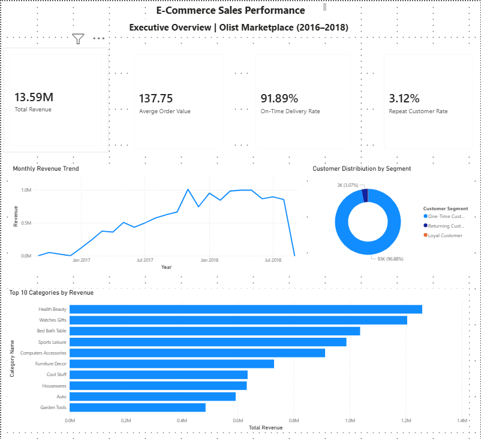
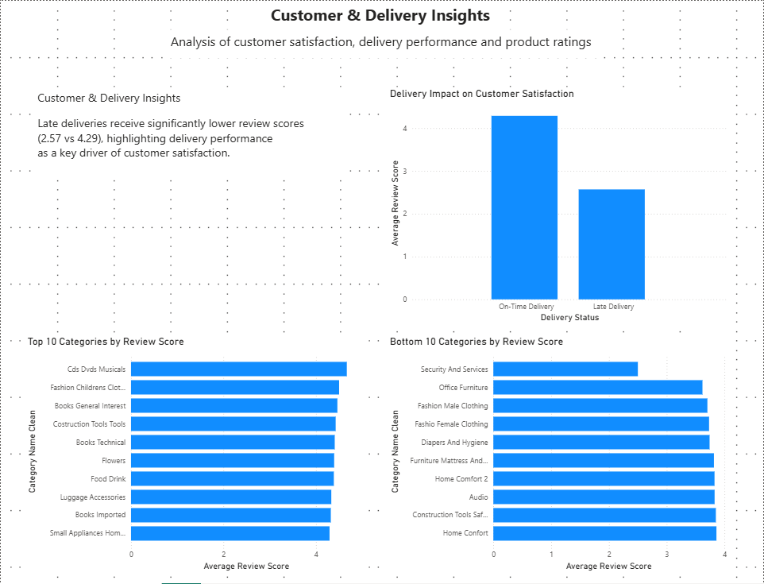

# E-Commerce Customer Analytics

## Project Overview

This project analyzes customer behaviour, sales performance, top product categories and delivery efficiency using the Olist E-Commerce dataset. 

The goal was to build an end-to-end analytics solution covering:
- Data loading and transformation with Python,
- PostreSQL database design and management,
- SQL-basen business analysis,
- Interactive Power BI dashboards,
- Business insights and recommendations.

The project demonstrates a complete analytics workflow from raw CSV files to business-ready dashboards.

## Business Questions

The project purpose is to answer questions listed below: 

### Sales Performance: 
- What is the total revenue made?
- How does the revenue change over time?
- What is the average order value?

### Customer Analysis:
- What is the percentage of customers that make repeat purchases?
- How can customers be segmented based on purchasing behaviour?

### Product Analysis:
- Which categories of products generate the highest revenue?
- Which categories have the highest rating?
- Which categories have the lowest rating?

### Delivery Analysis:
- How often are orders delivered on time?
- How does the delivery performane affect customer satisfaction?

## Dataset

Dataset used was: 
Brazilian E-Commerce Public Dataset by Olist 
https://www.kaggle.com/datasets/olistbr/brazilian-ecommerce/data

The dataset contains information about: customers, orders, order items, products, payments, reveiws, product categories and sellers.

## Tech Stack

Database: 
- PostgreSQL
- pgAdmin

Data processing:
- Python
- Pandas
- SQLAlchemy
- python-dotenv

Analytics:
- SQL

Data Visualization:
- Power BI

Version Control:
- Git
- GitHub

## Data Pipeline

```text
Raw CSV Files
      │
      ▼
Python ETL (Pandas + SQLAlchemy)
      │
      ▼
PostgreSQL Database
      │
      ▼
SQL Analysis
      │
      ▼
Power BI Dashboard
```

The analysis is based on the following tables:

- customers
- orders
- order_items
- products
- payments
- reviews
- category_translation

Relationships were modeled in Power BI to support customer, product, and delivery analysis.

## Executive Summary

The analysis identified two major business challenges.

First, customer retention is extremely low, with only 3.12% of customers making repeat purchases.

Second, delivery performance has a significant impact on customer satisfaction. Orders delivered on time achieved an average review score of 4.29, while delayed deliveries averaged only 2.57.

Despite these challenges, the marketplace generated 13.59M BRL in revenue and experienced strong growth throughout the analyzed period.

## Key Findings

### Customer Retention is Extremely Low

Analysis showed that customer retention is a major challenge for the business. 96.88% of customers made only one order with a Repeat Customer Rate of only 3.12%.

This indicates that the platform relies mainly on acquiring new customers than repeating ones. Improving retention and loyalty programs could increase long-term revenue.

### Delivery Performance Drives Customer Satisfaction

 Delivery Pefrormance makes a strong inlfuence on Customer Satisfaction. On-time deliveries received an average reveiw score of 4.29, while late deliveries received an average of 2.57. The platform maintained an On-time Delivery Rate of 91.89%. 

Customers who experienced delays of delivery were much less satisfies, which shows the importance of logistics efficiency.

### Revenue Grew Rapidly During Analyzed Period

Revenue analysis showed strong business growth over the analyzed period. Total revenue was 13.59M BRL with and average order value of 137.75 BRL. Monthly revenue increased throughout 2017 and stabilized in 2018.

### Revenue and Sales Volume Differ Across Categories

The analysis showed differences between revenue-generating and volume-generating categories. The category with the highest revenue was Health and Beauty (1.25M BRL) while being 2nd in the volume ranking. Bed Bath & Table recorder the highest sales volume and 3rd in the highest revenue ranking. Watches & gifts ranked second in revenue, while having a lower sales volume (7th in the ranking). 

### Product Satisfaction Varies Across Categories

Highest-rated categories were: 
- Cds, Dvds, Musicals
- Fashion CHildren Clothing
- Books General Interet.

Lowest-rated categories were:
- Security and services
- Office Furniture
- Fashion Male Clothing.

## Dashboard

### Executive Overview



### Customer & Delivery Insights



## Repository Structure

- **dashboard/** – Power BI dashboard (.pbix)
- **data/raw/** – source CSV files
- **python/** – ETL pipeline
- **sql/** – SQL analysis queries
- **screenshots/** – dashboard screenshots
- **.env.example** – environment variables template
- **README.md** – project documentation


## Future Improvements

Potential enhancements for future iterations:

- Customer lifetime value (CLV) analysis
- RFM customer segmentation
- Geographic sales analysis
- Sales forecasting
- Interactive drill-through reports in Power BI

## Author

**Marek Szostek**

LinkedIn: https://www.linkedin.com/in/marek-szostek/

GitHub: https://github.com/marekszostek